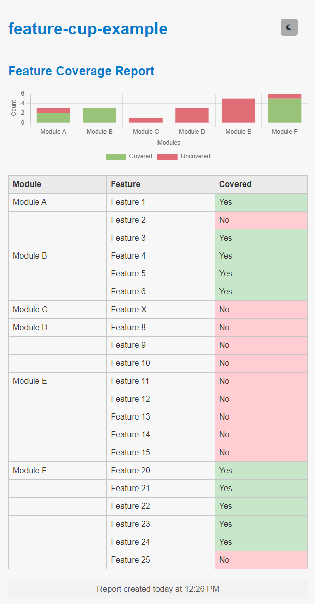
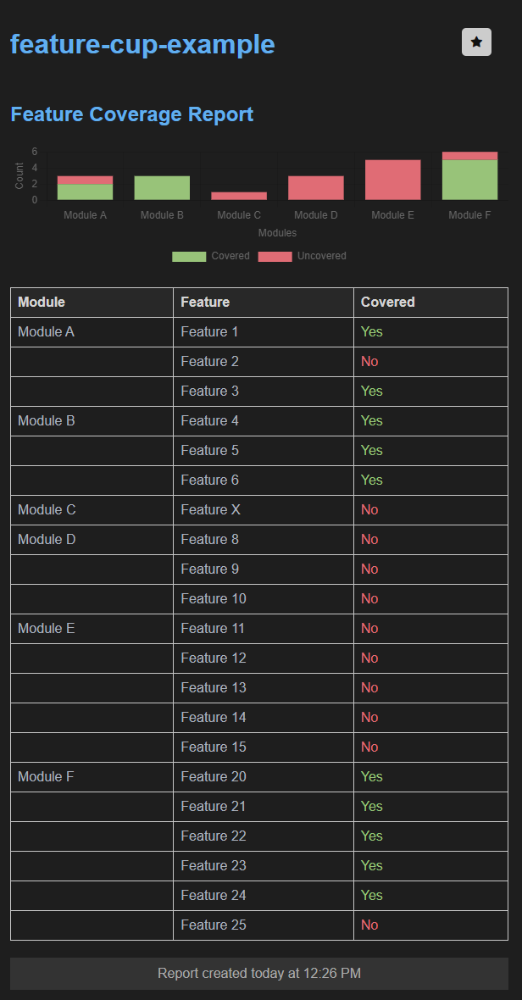

# feature-cup-example
Sample use of the feature-cup npm package to create feature coverage reports on your JS test automation.

## Installation
```bash
npm install
```

## Usage
```bash
npm run feature:default # generates default report shown in the console
npm run feature:html # generates html report
```

Checkout the theme button in the html report!

| Light theme         | Dark theme     |
|--------------|-----------|
|  |      | 

